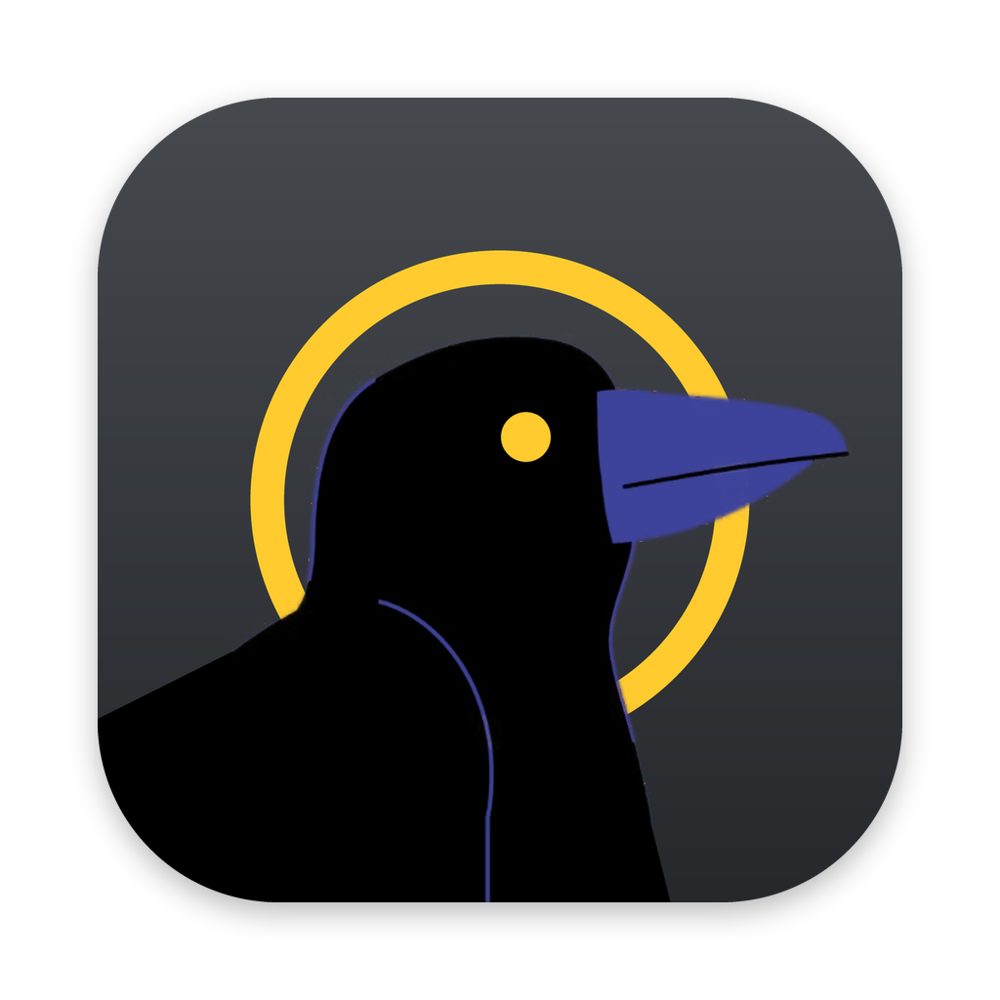

<p align="center">
  
</p>

<h1 align="center">Huginn</h1>

> Huginn — Odin's raven of *thought*, who flies over the world every morning and comes
> back to tell him what happened.

One inbox for every channel you have to answer. Huginn is a Mac app that brings what is
waiting for you from Slack, Gmail, GitLab, ClickUp, LinkedIn and Signal into one place,
sorts it into **Important**, **Undecided** and **Spam**, and lets you reply, react or
mark it done without opening each tool. It runs on your Mac and keeps everything there.

**Status: early.** Used daily by its author and a few people around him. Apple Silicon
Macs, macOS 13 or newer.

## Install

1. Download `Huginn_…_aarch64.dmg` from the
   [latest release](https://github.com/jozso39/huginn/releases/latest), open it and drag
   Huginn to Applications.
2. First start: Huginn is not signed by Apple yet, so macOS stops it once. Open it, click
   **Done**, then **System Settings → Privacy & Security → Open Anyway**.

After that it starts at login, lives in the menu bar (with the number of Important
items), and updates itself: it checks every hour and installs on restart.

## What it does

- **Inbox** grouped by conversation and by category (*Work*, *Personal*, …), each
  connection tinted with its own colour, updated live.
- **Reply, react, done** from Huginn; what you do lands in the **archive**, which is
  searchable. Answering at the source (in Slack, Gmail, Signal) clears it here too.
- **Triage** into Important, Undecided and Spam by per-connection rules, each decision
  naming the rule that made it. Condition rules work on their own; rules written as a
  sentence, and learning new rules from your reasons when you mark something Spam or
  Important, use an AI key of your own (Settings → AI Triage). Details:
  [docs/triage.md](docs/triage.md).
- **Notifications** for Important items, and the count in the menu bar and on the Dock.
- Messages look like they do at the source: Slack's formatting rendered like Slack;
  e-mail as a clean preview that opens into the real HTML in a sandbox, with no scripts
  and no remote images until you ask.
- Keyboard: `j`/`k` move, `r` reply, `e` done, `i` important, `s` spam, `o` open in source.
- Tokens are encrypted on disk (AES-256-GCM) with a key that never leaves the Mac.

## Connections

| Source | What comes in | Setup |
|---|---|---|
| **Slack** | DMs, mentions (yours and your groups'), replies in your threads, the channels you choose; reply and react as you | [docs/slack-app.md](docs/slack-app.md) |
| **Gmail** (any number) | unread inbox mail; reply in the thread, save a draft, done marks it read | [docs/gmail.md](docs/gmail.md) |
| **ClickUp** | tasks newly assigned to you, new comments on your tasks; reply in the thread | [docs/clickup.md](docs/clickup.md) |
| **GitLab** | todos: review requests, mentions, assignments; done marks the todo done | in the app |
| **LinkedIn** | messages, mentions and invitations, read from LinkedIn's e-mails in Gmail | [docs/linkedin.md](docs/linkedin.md) |
| **Signal** | your own account as a linked device: DMs and mentions; reply and react as you. Needs `brew install signal-cli` | [docs/signal.md](docs/signal.md) |

## Development

Needs [Bun](https://bun.sh) 1.4+, and Rust with the Xcode command line tools for the
Mac app.

```bash
bun install
bun run desktop:prepare     # builds the web app and the server binary
bun run desktop:dev         # the Mac app, with its own data folder (…huginn.dev)
```

The server on its own, in a browser: copy `.env.example` to `.env`, fill in the key, then
`bun run dev` (restarts on change) and `bun run dev:web` (Vite on :5173). Run
`bun run code:check && bun run test` before pushing (the pre-push hook does too).

A release: `bun run release 1.2.3` tags the version; GitHub Actions builds the app, signs
the update and publishes both. Installed copies pick it up within the hour.

## Documentation

- [docs/architecture.md](docs/architecture.md) — layers, data model, flows, API, security, the Mac app
- [CLAUDE.md](CLAUDE.md) — coding conventions (hexagonal, enforced by ESLint)
- [docs/triage.md](docs/triage.md) — how sorting and learning work
- [icons/README.md](icons/README.md) — the artwork and how the app's icons are made from it
- Connecting: [Slack](docs/slack-app.md) · [Gmail](docs/gmail.md) · [ClickUp](docs/clickup.md) · [LinkedIn](docs/linkedin.md) · [Signal](docs/signal.md)

## License

MIT
